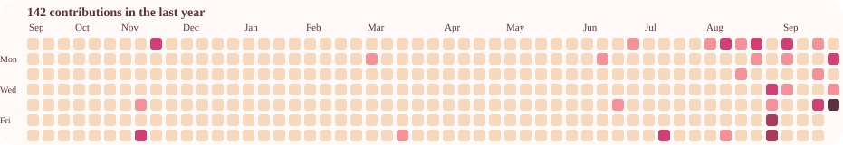

<!-- ==================== HEADER ==================== -->

 

<!-- ==================== TYPING ANIMATION ==================== -->

  

 

<!-- ==================== INTRODUCTION ==================== -->

<h2>🌸 About Me</h2>

<h3>I'm Pabasara Ranasinghe</h3>

<strong>Software Engineering Student • Developer • Builder</strong>

<blockquote>

Passionate about software engineering, turning ideas into meaningful projects, and continuously growing through every challenge. 🚀

</blockquote>

<blockquote>

Building projects, solving problems, and learning one commit at a time. 🌸

</blockquote>

<!-- ==================== SECTION SEPARATOR ==================== -->

  
  🌸
  

 

 

<!-- ==================== TECH STACK ==================== -->

<h3 align="center">💻 Languages</h3>

 

<h3 align="center">⚛️ Frontend</h3>

 

<h3 align="center">⚙️ Backend</h3>

 

<h3 align="center">🔧 Tools & Technologies</h3>

 

<!-- ==================== TECH ANIMATION ==================== -->

  <strong>React | Java | Spring Boot | MySQL</strong> 
  <strong>Frontend | Backend | REST APIs | AI</strong> 
  <strong>Building | Learning | Improving ⚡ Creating</strong>

 

<!-- ==================== SECTION SEPARATOR ==================== -->

  
  🌸
  

 

 

<!-- ==================== GITHUB CONTRIBUTIONS ==================== -->

Pabasara Ranasinghe's coding activity

 

<!-- ==================== SECTION SEPARATOR ==================== -->

  
  🌸
  

<!-- ==================== FEATURED PROJECTS ==================== -->

 

  

<!-- ==================== MEDORA ==================== -->

## 🩺 Medora

### 🤖 AI-Powered Healthcare Guidance Platform

A full-stack healthcare application that combines structured health
report analysis with AI-powered guidance through a simple web interface.

  

| Feature | Description |
| :--- | :--- |
| 🩺 Health Reports | Create and manage structured health reports |
| 📊 Report Analysis | Organize and interpret health-related report data |
| 🤖 AI Guidance | AI-powered health information and guidance |
| 🔐 Authentication | User registration and login |
| 🔗 REST API | Communication between frontend and backend |
| 🗄️ Database | MySQL-based data persistence |

 

<!-- ==================== GRADEXA ==================== -->

## 🎓 Gradexa

### 📚 Student Marks Management System

A full-stack academic management system designed to manage student
marks, term results, academic performance and role-based access.

  

| Feature | Description |
| :--- | :--- |
| 👨‍🎓 Students | Manage student academic information |
| 📝 Marks | Enter and manage term-based subject marks |
| 📊 Results | Calculate averages, totals and class positions |
| 🔐 Authentication | JWT-based secure authentication |
| 👥 Roles | Admin, teacher, student and management roles |
| 📄 Reports | Generate student marksheets and summaries |

 

<!-- ==================== MILK GUARD ==================== -->

## 🥛 MilkGuard Ecosystem

### 🌡️ Smart IoT Milk Quality Monitoring System

An IoT-enabled milk quality monitoring ecosystem that collects sensor
data through ESP32 devices and provides real-time monitoring and history.

  

| Feature | Description |
| :--- | :--- |
| 🥛 Milk Testing | Monitor milk quality using connected sensors |
| 📡 IoT Monitoring | Collect sensor readings through ESP32 |
| 🪪 RFID | Identify collectors using RFID cards |
| 📊 Dashboards | Owner and collector monitoring dashboards |
| 🚨 Alerts | Detect and notify about quality issues |
| 📜 History | Maintain permanent milk quality records |

 

<!-- ==================== EMERGENCY BLOOD NETWORK ==================== -->

## 🩸 Emergency Blood Network

### 🤖 AI + IoT Blood Management Platform

A full-stack emergency blood management platform connecting donors,
hospitals and blood banks with AI-assisted donor matching and IoT monitoring.

  

| Feature | Description |
| :--- | :--- |
| 🩸 Donors | Manage donor information and availability |
| 🏥 Hospitals | Support emergency blood requests |
| 🏦 Blood Banks | Manage blood stock and availability |
| 🤖 AI Matching | Assist with suitable donor matching |
| 🌡️ IoT Monitoring | Monitor blood storage conditions |
| 📊 Dashboards | Dedicated dashboards for system users |

 

<!-- ==================== TOURISM APPLICATION ==================== -->

## ✈️ Tourism Application

### 🌍 Microservices Tourism Booking Platform

A modern tourism platform for managing destinations,
travel packages and bookings through independent microservices.

  

| Feature | Description |
| :--- | :--- |
| 🌍 Destinations | Manage tourism destinations |
| 📦 Packages | Create and manage travel packages |
| 🎫 Bookings | Manage customer bookings |
| 🔐 Authentication | JWT-based authentication |
| 🚪 Gateway | Spring Cloud API Gateway |
| 🐳 Deployment | Docker & Docker Compose |

 

<!-- ==================== SECTION SEPARATOR ==================== -->

  
  🌸
  

 
 

<!-- ==================== EDUCATION ==================== -->

<table width="100%">
<tr>

<td width="33%" align="center" valign="top">

### 🚀 Certificate

**Certificate in Software Engineering**

 

National Institute of  
Business Management (NIBM)

📍 Colombo, Sri Lanka

</td>

<td width="33%" align="center" valign="top">

### 💻 Diploma

**Diploma in Software Engineering**

 

**GPA: 3.86**

 

National Institute of  
Business Management (NIBM)

📍 Colombo, Sri Lanka

</td>

<td width="33%" align="center" valign="top">

### 🎓 HND

**Higher National Diploma in Software Engineering**

 

**Ongoing**

 

National Institute of  
Business Management (NIBM)

📍 Colombo, Sri Lanka

</td>

</tr>
</table>

<!-- ==================== SECTION SEPARATOR ==================== -->

  
  🌸
  

 

 

<!-- ==================== CONNECT WITH ME ==================== -->

 

  

🌸 **Let's connect, collaborate and build something meaningful together.**

<!-- ==================== PROFILE VIEWS ==================== -->

<!-- ==================== FOOTER ==================== -->

  

<!-- ==================== THANK YOU ==================== -->

